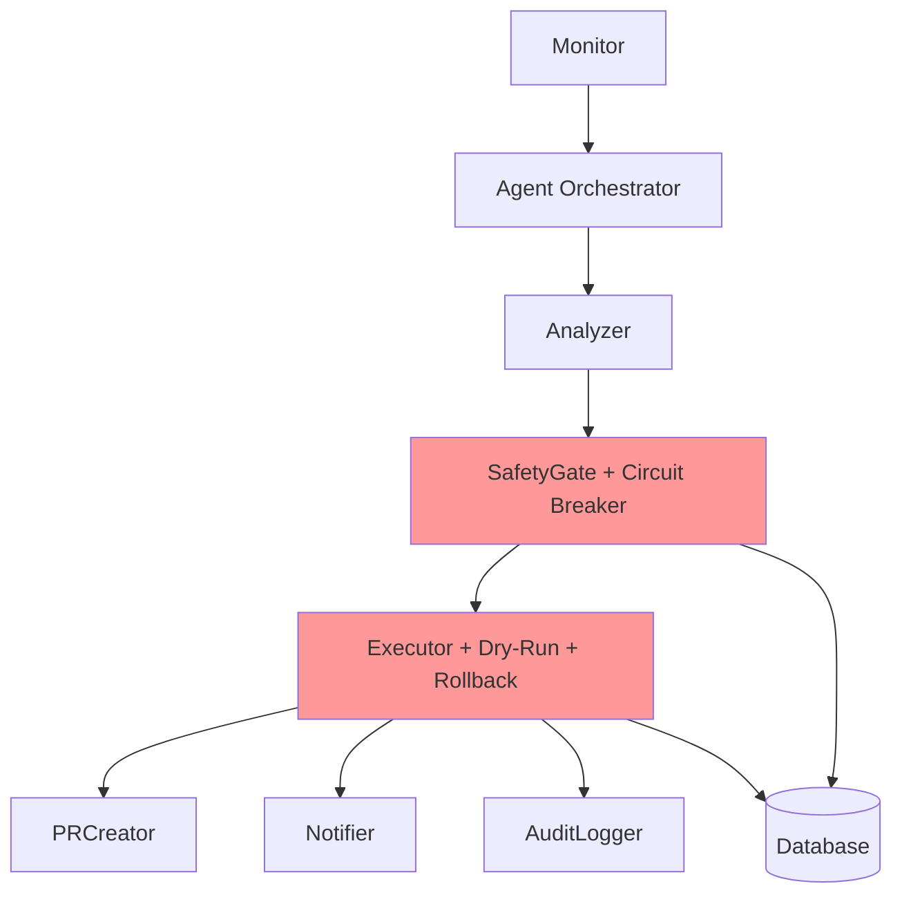
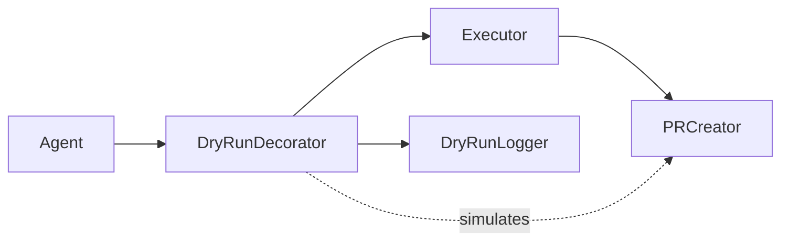
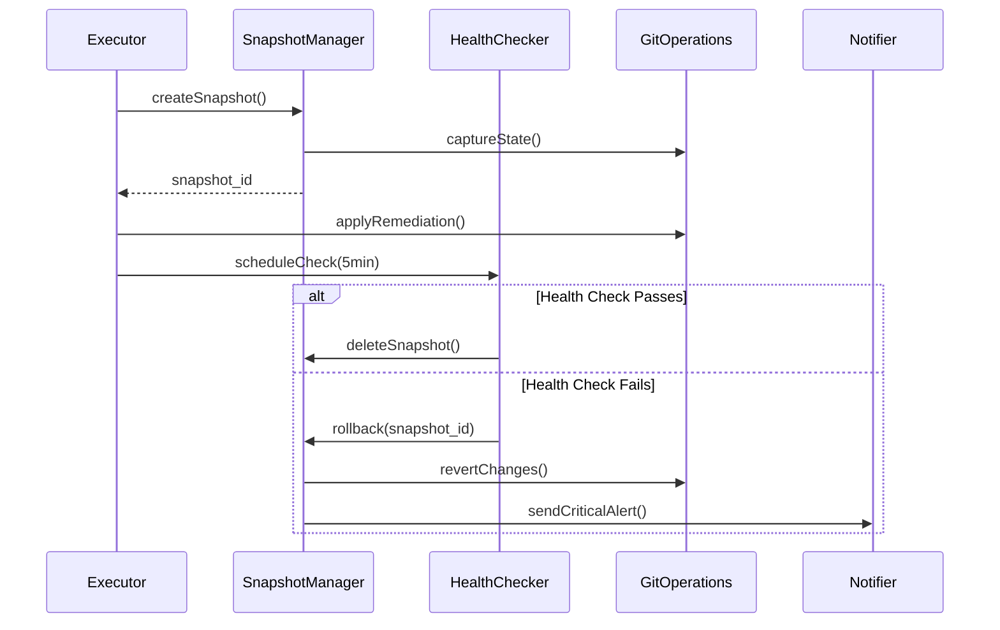
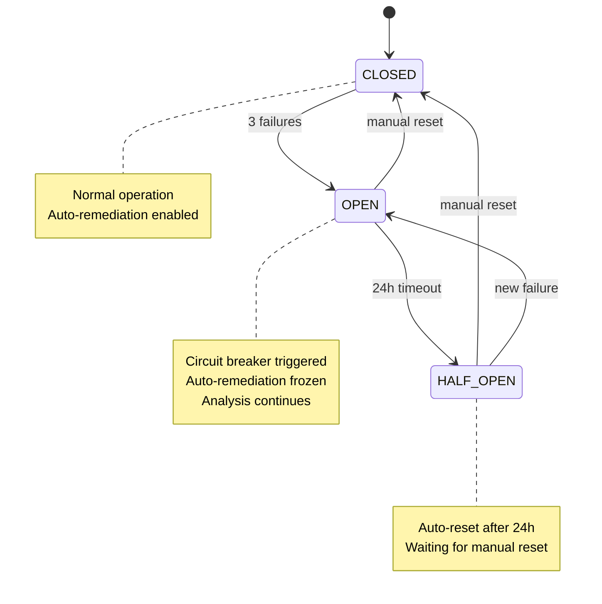

# Design Document: Critical Safety Features

## Overview

This design document specifies three critical safety features for the CI/CD Failure Monitor & Auto-Remediation Agent:

1. **Dry-Run Mode**: Allows testing the agent's behavior without making actual changes to repositories
2. **Remediation Rollback Engine**: Automatically reverts failed remediations to prevent cascading failures
3. **Circuit Breaker Pattern**: Prevents infinite retry storms by freezing auto-remediation after repeated failures

These features work together to ensure the agent operates safely in production environments. The dry-run mode enables safe testing, the rollback engine provides a safety net for bad fixes, and the circuit breaker prevents resource exhaustion from retry storms.

## Architecture

### System Context

The safety features integrate with existing system components:

- **Monitor**: Detects workflow failures
- **Analyzer**: Uses Groq API to analyze failures
- **SafetyGate**: Validates proposed fixes (enhanced with circuit breaker)
- **Executor**: Executes remediations (enhanced with dry-run and rollback)
- **PRCreator**: Creates pull requests with fixes
- **Notifier**: Sends Slack notifications
- **AuditLogger**: Records all actions
- **MetricsTracker**: Tracks system metrics
- **Database**: Stores state and history
- **Agent**: Orchestrates the entire pipeline

### Component Architecture



### Feature 1: Dry-Run Mode

**Architecture Pattern**: Decorator Pattern

The dry-run mode wraps the Executor component, intercepting all state-changing operations and logging them instead of executing them.



**Key Design Decisions**:
- Use a configuration flag (`--dry-run`) passed at agent startup
- Wrap all state-changing operations (PR creation, file modifications, Git operations)
- Maintain identical code paths for dry-run and production modes
- Log all simulated actions with `[DRY-RUN]` prefix for easy identification

### Feature 2: Remediation Rollback Engine

**Architecture Pattern**: Memento Pattern + Health Check Observer

The rollback engine creates snapshots before executing remediations and monitors health checks to trigger automatic rollback.



**Key Design Decisions**:
- Create snapshots immediately before remediation execution
- Use Git's native capabilities (commit SHAs, diffs) for snapshot storage
- Schedule health checks as async tasks with 5-minute delay
- Store snapshot metadata in database for audit trail
- Implement idempotent rollback operations

### Feature 3: Circuit Breaker Pattern

**Architecture Pattern**: State Machine + Failure Tracking

The circuit breaker tracks failure counts per repository and transitions between states (CLOSED, OPEN, HALF_OPEN).



**Key Design Decisions**:
- Track failure counts per unique failure signature (repo + workflow + error pattern)
- Store circuit breaker state in database for persistence across restarts
- Implement state transitions in SafetyGate component
- Allow manual reset via Slack command
- Continue monitoring and analysis even when circuit is open

## Components and Interfaces

### DryRunMode Component

**Responsibilities**:
- Intercept all state-changing operations
- Log simulated actions with clear prefixes
- Generate summary reports
- Maintain identical behavior to production mode

**Interface**:

```typescript
interface DryRunMode {
  // Configuration
  isEnabled(): boolean
  
  // Operation interception
  interceptPRCreation(prData: PRData): SimulatedResult
  interceptFileModification(fileOp: FileOperation): SimulatedResult
  interceptGitOperation(gitOp: GitOperation): SimulatedResult
  
  // Reporting
  logSimulatedAction(action: Action): void
  generateSummaryReport(): DryRunReport
}

interface SimulatedResult {
  action: string
  wouldExecute: boolean
  simulatedOutcome: string
  timestamp: Date
}

interface DryRunReport {
  totalActions: number
  prsThatWouldBeCreated: number
  filesModified: string[]
  gitOperations: string[]
  analysisResults: AnalysisResult[]
}
```

### SnapshotManager Component

**Responsibilities**:
- Create repository state snapshots
- Store snapshot metadata
- Execute rollback operations
- Clean up old snapshots

**Interface**:

```typescript
interface SnapshotManager {
  // Snapshot operations
  createSnapshot(repo: Repository): Promise<Snapshot>
  rollback(snapshotId: string): Promise<RollbackResult>
  deleteSnapshot(snapshotId: string): Promise<void>
  
  // Query operations
  getSnapshot(snapshotId: string): Promise<Snapshot>
  listSnapshots(repo: Repository): Promise<Snapshot[]>
}

interface Snapshot {
  id: string
  repositoryId: string
  commitSHA: string
  branchName: string
  modifiedFiles: FileSnapshot[]
  createdAt: Date
  metadata: SnapshotMetadata
}

interface FileSnapshot {
  path: string
  contentHash: string
  content: string
}

interface SnapshotMetadata {
  remediationId: string
  failureId: string
  reason: string
}

interface RollbackResult {
  success: boolean
  snapshotId: string
  filesReverted: string[]
  commitSHA: string
  error?: string
}
```

### HealthChecker Component

**Responsibilities**:
- Schedule health checks after remediations
- Execute health check logic
- Trigger rollback on failure
- Report health status

**Interface**:

```typescript
interface HealthChecker {
  // Scheduling
  scheduleCheck(remediationId: string, delayMinutes: number): Promise<void>
  cancelCheck(remediationId: string): Promise<void>
  
  // Execution
  executeHealthCheck(remediationId: string): Promise<HealthCheckResult>
  
  // Callbacks
  onHealthCheckPass(callback: (remediationId: string) => void): void
  onHealthCheckFail(callback: (remediationId: string) => void): void
}

interface HealthCheckResult {
  remediationId: string
  passed: boolean
  checks: CheckResult[]
  timestamp: Date
}

interface CheckResult {
  name: string
  passed: boolean
  message: string
  details?: any
}
```

### CircuitBreaker Component

**Responsibilities**:
- Track failure counts per repository
- Manage circuit breaker state transitions
- Enforce remediation freezes
- Handle manual and automatic resets

**Interface**:

```typescript
interface CircuitBreaker {
  // State management
  getState(failureSignature: string): CircuitBreakerState
  recordFailure(failureSignature: string): Promise<StateTransition>
  recordSuccess(failureSignature: string): Promise<void>
  
  // Control operations
  manualReset(failureSignature: string): Promise<void>
  isRemediationAllowed(failureSignature: string): boolean
  
  // Query operations
  getFailureCount(failureSignature: string): number
  listOpenCircuits(): Promise<CircuitBreakerState[]>
}

enum CircuitState {
  CLOSED = "CLOSED",
  OPEN = "OPEN",
  HALF_OPEN = "HALF_OPEN"
}

interface CircuitBreakerState {
  failureSignature: string
  state: CircuitState
  failureCount: number
  lastFailureAt: Date
  openedAt?: Date
  autoResetAt?: Date
}

interface StateTransition {
  previousState: CircuitState
  newState: CircuitState
  reason: string
  shouldNotify: boolean
}

interface FailureSignature {
  repositoryId: string
  workflowName: string
  errorPattern: string
  
  // Generate unique key
  toKey(): string
}
```

## Data Models

### DryRunLog

Stores simulated actions during dry-run mode.

```typescript
interface DryRunLog {
  id: string
  sessionId: string
  timestamp: Date
  actionType: ActionType
  component: string
  description: string
  simulatedData: any
  wouldSucceed: boolean
}

enum ActionType {
  PR_CREATION = "PR_CREATION",
  FILE_MODIFICATION = "FILE_MODIFICATION",
  GIT_OPERATION = "GIT_OPERATION",
  NOTIFICATION = "NOTIFICATION",
  API_CALL = "API_CALL"
}
```

### Snapshot

Stores repository state for rollback capability.

```typescript
interface Snapshot {
  id: string
  repositoryId: string
  remediationId: string
  commitSHA: string
  branchName: string
  modifiedFiles: FileSnapshot[]
  createdAt: Date
  expiresAt: Date
  status: SnapshotStatus
}

enum SnapshotStatus {
  ACTIVE = "ACTIVE",
  ROLLED_BACK = "ROLLED_BACK",
  EXPIRED = "EXPIRED",
  DELETED = "DELETED"
}
```

### HealthCheck

Stores health check execution results.

```typescript
interface HealthCheck {
  id: string
  remediationId: string
  snapshotId: string
  scheduledAt: Date
  executedAt?: Date
  passed: boolean
  checks: CheckResult[]
  triggeredRollback: boolean
}
```

### CircuitBreakerRecord

Stores circuit breaker state and history.

```typescript
interface CircuitBreakerRecord {
  id: string
  failureSignature: string
  repositoryId: string
  workflowName: string
  errorPattern: string
  state: CircuitState
  failureCount: number
  lastFailureAt: Date
  openedAt?: Date
  autoResetAt?: Date
  manuallyResetAt?: Date
  manuallyResetBy?: string
  history: StateTransitionRecord[]
}

interface StateTransitionRecord {
  timestamp: Date
  fromState: CircuitState
  toState: CircuitState
  reason: string
  triggeredBy: string
}
```

### Configuration

Extended configuration for safety features.

```typescript
interface SafetyConfiguration {
  dryRun: {
    enabled: boolean
    logLevel: LogLevel
    generateReport: boolean
  }
  
  rollback: {
    enabled: boolean
    healthCheckDelayMinutes: number
    snapshotRetentionDays: number
    healthChecks: HealthCheckConfig[]
  }
  
  circuitBreaker: {
    enabled: boolean
    failureThreshold: number
    autoResetHours: number
    trackingWindow: number
  }
}

interface HealthCheckConfig {
  name: string
  type: HealthCheckType
  config: any
}

enum HealthCheckType {
  WORKFLOW_SUCCESS = "WORKFLOW_SUCCESS",
  BUILD_SUCCESS = "BUILD_SUCCESS",
  TEST_PASS = "TEST_PASS",
  CUSTOM_SCRIPT = "CUSTOM_SCRIPT"
}
```

